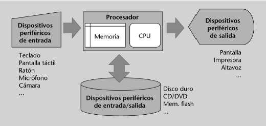
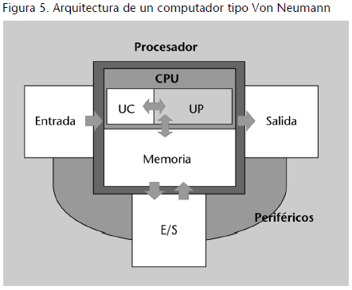
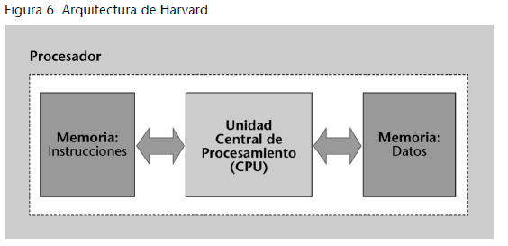

# Tema 1: Introducción a los fundamentos de los computadores

## 1. El estudio de los fundamentos de los computadores

### 1.1 ¿Por qué estudiar los fundamentos de los computadores?

Porque se trata de un conocimientos necesario tanto si nos dedicamos al desarrollo de aplicaciones, análisis de sistemas o desarrollo de circuitería.

Para poder desarrollar aplicaciones optimizadas necesitamos conocer los paradigmas básicos del funcionamiento de la máquina en la que se va a ejecutar, ya sea una aplicación de escritorio o instrucciones en un PLC industrial.

El conocimiento del funcionamiento de los computadores es por tanto necesario tanto para diseñar sistemas electrónicos, programarlos, o desarrollar aplicaciones con cierto grado de optimización.

### 1.2 ¿Qué tenemos que saber para entender los computadores?

Que los computadores son aparatos electrónicos. Que la electrónica trabaja con señales eléctricas.

Por esto debemos saber cómo procesar la información a través de estas señales eléctricas. Necesitamos saber cómo codificar la información, cómo son los datos y cuales son las limitaciones implícitas en las máquinas.

Los computadores se basan en la _electrónica digital_.

Debemos además saber cómo podemos usar la electrónica digital para poder construir un computador digital. Tener una metodología para poder concebir sistemas digitales complejos que nos permitan obtener un computador convencional.

#### 1.2.1 ¿Qué es la electrónica digital?

Es la electrónica basada en señales eléctricas dentro de un conjunto finito o discreto de de valores diferentes. Lo habitual es usar dos valores, por ejemplo 0 V y 5 V.

Por contra, la electrónica analógica una un rango continuo de valores, como puede ser cualquier valor del 0 a 15 V.

En las tecnologías actuales se trabaja especialmente bien cuando trabajamos con dos valores de tensión. A estos valores dependiendo del ámbito se les denomina _verdadero_ y _falso_ o _0 y 1 lógicos_

Toda información que debe procesar un computador de este tipo debe por tanto estar codificada usando los dos valores de tensión posible, 0 y 1 lógicos.

#### 1.2.2 La codificación de la información

En la realidad, toda la información siempre está codificada de una forma u otra. Al escribir usamos un número concreto de símbolos. Cuando hablamos de números usamos dígitos, que son otro conjunto de símbolos. Los computadores digitales usan dos dígitos: 0 y 1.

Codificar números es fácil de comprender: un valor numérico es un concepto abstracto que tiene una representación u otra según se use un sistema de numeración u otro (decimal o binario por ejemplo)

Al principio el hombre representaba números con dibujos de las cantidades que quería representar. Posteriormente se usaron sistemas basados en los elementos que el hombre tenía a disposición: 5 dedos de una mano, 10 dedos de las dos manos, 12 huesos de los dedos opuestos al pulgar...

Finalmente salió ganadora la base 10.

Con los ordenadores pasó algo similar. Finalmente se ha usado un sistema basado en su propia anatomía: con tensión y sin tensión. Por esto debemos usar un sistema de base 2.

Esto hace que, aunque las operaciones aritméticas no sean diferentes, si lo son los procesos sobre cómo proceder a realizarlas.

#### 1.2.3 Los sistemas digitales

La electrónica digital es conceptualmente la electrónica de los números. Las señales eléctricas representan números.
La electrónica analógia, por contra, funciona con ondas, que son más susceptibles de degradarse y perder parte de la información.

Intentar entender o construir un circuito digital complejo es inviable sin las herramientas y métodos adecuados para sistematizar dicha construcción.

Tenemos una diferenciación importante entre los **circuitos combinacionales** (sin capacidad de memoria) y los **circuitos secuenciales** (con capacidad de memoria) que veremos por separado en sus diferentes módulos.

## 2. La evolución de los computadores

Los primeros intentos de desarrollar ingenios mecánicos para el procesamiento de datos, especialmente para los cálculos artiméticos fueran mecanismos básicos como el ábaco o realmente complejos como la máquina diferencial de **Charles Babbage**.

Charles Babbage (1791-1871) concebió la **máquina analítica** que fue la primera vez que se pensó en una máquina dirigida por un programa externo. Esta máquina tenía una memoria mecánica, una unidad de procesamiento, una _unidad de control_ formada por una serie de "barriles", una entrada de datos inspirada en las tarjetas perforadas del telar de **Jaquard** y una salida por impresión.

Con el uso de la energía eléctrica se desarrollaron máquinas electromecánicas con lectores de tarjetas y procesamiento con conmutadores. De estos tipos de máquina se puede destacar la **máquina tabuladora** de **Herman Hollerith** (1860 - 1929). Esta máquina ayudó a realizar el censo de EEUU pasando a durar 3 años, en un proceso que manualmente llevaba 10 años. Se considera que Herman Hollerinth fue la primera persona en hacer un tratamiento automatizado de la información, el primer informático.

Posteriormente, con el desarrollo de las máquinas electromecánicas aparecieron los **primeros ordenadores digitales**. El primero en aparecer fue el **Z1** del **Konrad Zuse** (1910-1995) que disponía de memoria mecánica binaria. Él mismo desarrollo luego la **Z2** que realizaba las operaciones de procesamiento a partir de relés y mejoras que acabaron en la **Z3** y **Z4**. De forma contemporánea **George Stibitz** (1904-1995) concibió computadores de relés para los laboratorios Bell, mientras que **Howard Aiken** (1900-1973) desarrolló la serie **Mark** para la **Universidad de Harvard**. Todas estas fueron las primeras máquinas desarrolladas con propósito comercial.

El conflicto de la II Guerra Mundial significó un impulso importante en el desarrollo de la electrónica computacional y en el desarrollo de los computadores electrónicos distinguiendo 4 generaciones:

### 2.1 Primera generación (1940-1955)

Marcada por el uso de válvulas de vacío y anillos de ferrita para la memoria.

- ENIAC (Mauchly y Eckert - 1941-1945) Moore School: _Electronic Numerical Integrator And Computer_ 18000 válvulas de vacío, 70000 resistencias y 10000 condensadores. Ocupaba 100 m2, pesaba 30 tn y consumía 140 kw/h
- EDVAC (1952) Moore School: _Electronic Discrete Automatic Computer_: Sobre la que **Von Neumann** escribió el _First Draw of a Report on the EDVAC_, el primero documento donde se describe el concepto de **programa almacenado** y el uso de la **aritmética binaria** en detrimento de la decimal.
- UNIVAC (Mauchly y Ecker - 1951) Ecker-Mauchly Company: _Universal Automatic Computer_ con la característica de contener un **programa parcialmente almacenado**

### 2.2 Segunda generación 1955 - 1965

El paso a la segunda generación está marcado por el uso de transistores en vez de válvulas de vacío. Las principales máquinas de esta generación son:

- PDP-1 de DEC (1960), que presenta por primera vez un **terminal gráfico**. Esta máquina además fue la primera sobre la que se ejecutó el primer videojuego.
- IBM 7030 (1961). Incorporó la idea de **segmentación de memoria** y **memoria virtual**, como técnias que mejoraron la capacidad, gestión y rendimiento de la memoria.
- ATLAS (1962) de Ferranti Ltd y U. Manchester. El primer **Supercomputador**. Destaca por la incorporación de **interrupciones** para controlar los periféricos.
- CDC 6600 (1964) ALcanzó la velocidad de cálculo de 1 megaFLOPS (1 millon de operaciones de coma flotante por segundo) usaba de forma paralela diferentes unidades de cálculo.

### 2.3 Tercera generación (1965 - 1970)

Marcada por la aparición de los primeros circuitos integrados. Los circuitos integrados aportan una reducción significativa de espacio y consumo además de añadir fiabilidad. Estos avances favorecen la aparición de los primeros minicomputadores.

- IBM 360 (1964): Inició la primera serie de **computadores compatibles**: Podían usar el mismo software y los mismos periféricos.
- DEC PDP/8 (1965): Primer minicomputador con éxito comercial. Introdujo los **circuitos lógicos en módulos integrados** o **(chips)** y el conjunto de líneas en paralelo para interconectar módulos: **el bus**
- IMB 360/85 (1968): Primer computador en incorporar el concepto de **memoria caché**, como técnica que redujo enormemente el tiempo de acceso a la memoria y que es un concepto central en los sistemas actuales.

### 2.4 Cuarta generación (1970 - )

Con la mejora del proceso de fabricación de los circuitos integrados se produce un aumento considerable de la densidad de integración. Este aumento permite la integración de todos los circuitos de la unidad central en un único chip: **el microprocesador**, siendo el primero el **Intel 4004** en 1971.

Al mismo tiempo se van abandonando las memorias de ferritas en favor de las memorias de semiconductores. Estos cambios permitieron la aparición de los primeros ordenadores personales:

- Altair 8800 (1975): Considerado el primer ordenador personal.
- Supercomputador Cray I (1976): Incorpora por primera vez el procesamiento paralelo.
- IMB PC (1981): Con el microprocesador 8086 y el sistema operativo Microsoft DOS, marcan el inicio de la revolución de la computación personal.
- Lisa (APPLE, 1983): Incorpora el ratón y una interfaz de usuario gráfica (Estilo Windows)

## 3. ¿Cómo son los computadores digitales actuales?

| Un **computador** es un dispositivo construido con el propósito de manipular y transformar información para conseguir una información más elaborada, como el resultado de un problema determinado.

Un computador digital es un computador que trabaja con datos numéricos, cuya interpretación depende del formato con el que esté trabajando, codificados todos ellos en un sistema numérico en base 2, es decir, basados en señales binarias, sobre las que podemos identificar sólo dos valores distintos.

Mientras que el concepto de computador es independiente de la tecnología, en la actualidad los computadore digitales están basados en la electrónica digital, por lo que un computador digital actual es un sistema digital electrónico complejo.

Su complejidad hace inviable ser concebido si una estructura y organización en módulos diferenciados con tareas y funcionalidades bien definidas. La estructura general de un computador digital es la que podemos ver en la figura 1:

</img>

Los dispositivos de entrada y los de salida son elementos de conversión entre el mundo analógico que nos rodea y el mundo digital con el que trabaja el procesador. Los dispositivos entrada/salida son dispositivos principalmente para almacenar y recuperar datos almacenados.

El procesador consta de una unidad central de procesamiento o **CPU** y una **memoria** íntimamente relacionada con la CPU.

La CPU es la encargada de procesar los datos de acuerdo con el programa establecido. La CPU a su vez consta de dos partes: Una **unidad de control** y una **unidad de proceso**. En la unidad de proceso se encuentran los recursos de cálculo, mientras que la unidad de control es la encargada de que las operaciones se realicen en el orden correcto.

### 3.1 Arquitectura de Von Neumann

Se conoce por este nombre a la arquitectura que implementan los ordenadores actuales, que fue descrita por John Von Neumann durante su colavoración en el proyecto de desarrollo del EDVAC (ver [epígrafe 2.2](#22-segunda-generación-1955---1965)).

Se diferencia porque tanto los datos como el programa se almacenan en la memoria principal, que además está ligada directamente con la CPU.

La idea de un programa almacenado rompía con la práctica anterior que modificaba el circuito electrónico cuando se modificaba el programa.

Por tanto, las características principales de la arquitectura son:

1. Programa almacenado: Tanto los datos como las instrucciones en la memoria principal. Esto implicó que el computador pudiera tener amplia generalidad y también que la comunicación entre unidad de procesamiento y memoria fuese crítica para el rendimiento de la máquina.
2. Unidad de control simple: La unidad de control no se tiene que ocupar de ejecutar todo el programa, sino de hace iterativamente una única tarea: el ciclo de ejecución de instrucciones.

</img>

### 3.2 Arquitectura Harvard

La arquitectura Von Neumann tiene dos grandes limitaciones: El acceso a memoria es crítico y limita el rendimiento del sistema y el diseño implica una ejecución secuencial.

De las arquitecturas "no Von Neumann" cabe destacar la **arquitectura Harvard**. Se caracteriza porque dispone de una memoria dedicada al programa y otra dedicada a los datos. Esto corrije la limitación que supone el acceso a la memoria al poder acceder a la memoria de datos mientras que se accede a la memoria del programa. Además limita la automodificación de los programas, que en un principio se consideraba una ventaja, pero que ha llegado a convertirse en un problema.

El uso de esta arquitectura se ha extendido en los microcontroladores y la electrónica distribuida.

</img>

**_FIN DEL TEMA_**
